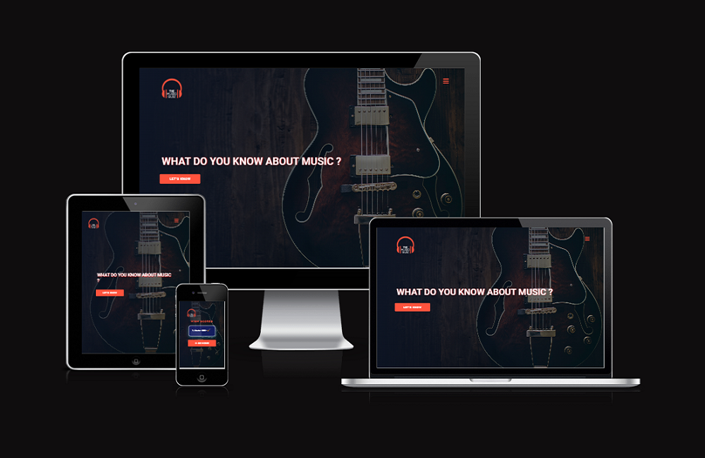

# The Music Quiz
(Developers: )

[Live Webpage](https://8000-chrisfahert-cihackt16mq-ww9joothxyz.ws-eu74.gitpod.io/)

## About

The Music Quiz website has been developed to provide users the chance to play the music quizzes and learn about different types of music. This website contains quizzes based on Jazz, Rock, Pop, Classic and EDM (Electronic dance music). 

## Table of Contents

- [The Music Quiz](#the-music-quiz)
  - [About](#about)
  - [Table of Contents](#table-of-contents)
  - [Project Goals](#project-goals)
    - [User Goals](#user-goals)
    - [Site Owner Goals](#site-owner-goals)
  - [User Experience](#user-experience)
    - [Target Audience](#target-audience)
    - [User Requirements and Expectations](#user-requirements-and-expectations)
    - [User Manual](#user-manual)
      - [Overview](#overview)
      - [Home page](#home-page)
      - [Quiz page](#quiz-page)
      - [Quiz End page](#quiz-end-page)
      - [High Score page](#high-score-page)
    - [User Stories](#user-stories)
      - [First-time  User](#first-time--user)
      - [Site Owner](#site-owner)
  - [Technical Design](#technical-design)
    - [Flowchart](#flowchart)
  - [Technologies Used](#technologies-used)
    - [Languages](#languages)
    - [Framework and Tools](#framework-and-tools)
  - [Features](#features)
    - [Existing Features](#existing-features)
      - [Home page](#home-page-1)
      - [Quiz page](#quiz-page-1)
  - [Testing](#testing)
    - [Validator Testing](#validator-testing)
    - [Testing user stories](#testing-user-stories)
    - [Fixed Bugs](#fixed-bugs)
  - [Deployment](#deployment)
    - [Deploying to Github Pages](#deploying-to-github-pages)
    - [Forking the GitHub Repository](#forking-the-github-repository)
  - [Credits](#credits)
  - [Acknowledgements](#acknowledgements)

## Project Goals

### User Goals

 - Be able to easily interact with the app to play the quiz.
 - Be able to choose different type of music (Jazz, Rock, Pop, Classical, EDM) quiz.
 - Navigate the app seamlessly.
 - Receive clear instructions on the rules to play the quiz.
 - Receive the clear result on their current input options.
 - Receive the total score and result of the quiz.

### Site Owner Goals

 - To provide user an easy-to-use app to play music quiz from The Music Quiz.
 - To provide the user with quizzes on different types of music (Jazz, Rock, Pop, Classic, EDM).
 - To provide the user with the ability to view the current score.
 - To provide the user the ability to view the total score and result of the quiz.
 - To provide the user to view the total number of questions within a quiz.
 - To provide the ability to view the current status of question within a quiz.

## User Experience

### Target Audience

 - People looking to play Music quizzes.
 - People looking to learn about different types of music.

### User Requirements and Expectations

 - The ability to seamlessly navigate through the app.
 - To use an app that provides a quiz on different types of music to the user.

### User Manual

Instructions

#### Overview

The Music Quiz app is for users who wish to enhance the knowledge about different type of music (Jazz, Rock, Pop, Classic, EDM) by playing interactive quizzes. Each page provides the logo at the top left corner and nav button to navigate to home page.

#### Home page

The landing page of the website welcomes the user. It provides the toggle icon at the top right corner to navigate the user to different pages of the website. The "Let's Know" nav button directly navigates the user to the quiz page by randomly selecting one of the music type. Alternatively, user can select particular type of quiz through toggle button.

#### Quiz page

The Quiz page provides user the following features:
- Question with four options.
    - User selection is highlighted with green for right answer and red for wrong answer.
    - User is also provided with textual feedback on the selection.
- Progress bar for progress of the quiz.
- Selected music type for the quiz.
- Current question number from total number of questions.
- Current status of the score.  
- Nav button to navigate to home page.
- On completion of the quiz, user is automatically navigated to Quiz End page.

#### Quiz End page

The Quiz End page provides the following features:
- option to save the quiz score by entering user name. 
- After saving the score along with user name, user is automatically navigated to high score page.
- Nav button to navigate to home page.

#### High Score page

The High Score page provides the following features:
- Shows the top six high scores along with user names.
- If user answers more than certain number of questions correctly, user is navigated automatically to Trophy page. 
- Nav button to navigate to home page.

[Back to Table Of Contents](#table-of-contents)

### User Stories

#### First-time  User

1. As a user, I want to be:
    - Able to find interesting and meaningful quiz.
    - Able to understand the quiz rules.
    - Able to view my score and the result.
    - Able to use all buttons and links perfectly.
    - Able to easily understand the context.
    - Able to easily navigate to all pages.

#### Site Owner
2.  As the site owner, I would want:
    - User to be greeted with a welcome message to give a friendly feel to the app.
    - To provide a music relevent and well instructed quiz.
    - The user to be able to see his score after each step.
    - The user should be able to navigate through all the pages easily.
    - The user learn something in regards to music.
    - The user to get feedback based on their input.
    - To provide a clear text of question and options. 

## Technical Design

### Flowchart

The following flowchart sumerises the structure of the Game.

Overview

Options

## Technologies Used

### Languages
- HTML, CSS and JavaScript were used to creat this website.

### Framework and Tools
* [Git](https://git-scm.com/) Used for version control to push the code to GitHub.
* [GitHub](https://github.com/) Used as a repository to store the projects code.
* [lucidchart](https://www.lucidchart.com/) Used to create the project flow.
* [Am I Responsive?](https://ui.dev/amiresponsive) To show the website image on arange of devices.

## Features

### Existing Features

#### Home page

On the home page, the logo in the upper left corner shows the name of the website. By clicking on the 'Let's Know' button, the user can start the quiz to test his knowledge of music. Alternatively, the toggle button in the top right corner also gives the user the option to select a particular type of music quiz.

#### Quiz page

The Quiz page displays the Quiz area with the first question of the quiz with four options. The result is displayed in green color with sound effects if the user clicks on the right answer and if wrong, the result is displayed in red with different sound effects. The progress of the quiz is displayed by a progress bar below the logo. At the bottom left corner, the user can see the current question count from the total number of questions and at the bottom right, the current score is displayed. User can navigate to home page by clicking on 'GO HOME' button even if he/she is in the middle of a quiz.

* C
    * T

* L
    * T

* A
    * T

* V
    * T

 * E
    * T

 * E
    * T

 * E
    * T 

 * E
    * T

* E
    * T

[Back to Table Of Contents](#table-of-contents)

## Testing

* Testing was condicted in three ways.
    * T

### Validator Testing
* p
    * N

    

    
    

    

    
    

    

    
    

    

    
    

### Testing user stories
1. I want to the 

| **Feature** | **Action** | **Expected Results** | **Actual Result** |
|-------------|------------|----------------------|-------------------|
| M | I | U | W |
| L | I| U | W |
| L | I| U | W |

Screenshots

2. I want to be able to .

| **Feature** | **Action** | **Expected Results** | **Actual Result** |
|-------------|------------|----------------------|-------------------|
| M | I | U | W |
| L | I| U | W |
| L | I| U | W |

Screenshots

3. I want to .

| **Feature** | **Action** | **Expected Results** | **Actual Result** |
|-------------|------------|----------------------|-------------------|
| M | I | U | W |
| L | I| U | W |
| L | I| U | W |

Screenshots

4. I want to .

| **Feature** | **Action** | **Expected Results** | **Actual Result** |
|-------------|------------|----------------------|-------------------|
| M | I | U | W |
| L | I| U | W |
| L | I| U | W |

Screenshots

5. I want to.

| **Feature** | **Action** | **Expected Results** | **Actual Result** |
|-------------|------------|----------------------|-------------------|
| M | I | U | W |
| L | I| U | W |
| L | I| U | W |

Screenshots

6. I want to .

| **Feature** | **Action** | **Expected Results** | **Actual Result** |
|-------------|------------|----------------------|-------------------|
| M | I | U | W |
| L | I| U | W |
| L | I| U | W |

Screenshots

7. I want to.  

| **Feature** | **Action** | **Expected Results** | **Actual Result** |
|-------------|------------|----------------------|-------------------|
| M | I | U | W |
| L | I| U | W |
| L | I| U | W |

Screenshots

8. I want users to.

| **Feature** | **Action** | **Expected Results** | **Actual Result** |
|-------------|------------|----------------------|-------------------|
| M | I | U | W |
| L | I| U | W |
| L | I| U | W |

Screenshots

9. I want users to .

| **Feature** | **Action** | **Expected Results** | **Actual Result** |
|-------------|------------|----------------------|-------------------|
| M | I | U | W |
| L | I| U | W |
| L | I| U | W |

Screenshots

10. I want users to.

| **Feature** | **Action** | **Expected Results** | **Actual Result** |
|-------------|------------|----------------------|-------------------|
| M | I | U | W |
| L | I| U | W |
| L | I| U | W |

Screenshots

11. I want users to.

| **Feature** | **Action** | **Expected Results** | **Actual Result** |
|-------------|------------|----------------------|-------------------|
| M | I | U | W |
| L | I| U | W |
| L | I| U | W |

Screenshots

[Back to Table Of Contents](#table-of-contents)

### Fixed Bugs
* Wh
    * FIX:

## Deployment

### Deploying to Github Pages

* The site was deployed to GitHub pages. The steps to deploy are as follows:

    - In the GitHub repository, navigate to the Settings tab
    - From the side menu, select pages under Code and automation, select the main Branch, then click to save button.
    - Once the main branch has been selected, the page will be automatically refreshed with a detailed ribbon display to indicate the successful deployment.

  The live link can be found here- https://8000-chrisfahert-cihackt16mq-ww9joothxyz.ws-eu74.gitpod.io/

### Forking the GitHub Repository

* The steps to fork the github repository

    - Go to the GitHub repository,
    - In the top right hand corner you can click on the fork button,
    - This will fork the repositry.

## Credits

* Quiz Questions: 
    * [https://www.factmonster.com/take-quiz/jazz](https://www.factmonster.com/take-quiz/jazz)
    * [https://www.ultimatequizquestions.com/jazz-quiz/](https://www.ultimatequizquestions.com/jazz-quiz/)
    * [https://www.quiztriviagames.com/pop-music-quiz/](https://www.quiztriviagames.com/pop-music-quiz/)
    * [https://www.usefultrivia.com/music_trivia/classical_music_trivia.html](https://www.usefultrivia.com/music_trivia/classical_music_trivia.html)
    * [http://www.freepubquiz.co.uk/orchestra-quiz.html](http://www.freepubquiz.co.uk/orchestra-quiz.html)
    * [https://play.howstuffworks.com/quiz/electronic-dance-music-quiz](https://play.howstuffworks.com/quiz/electronic-dance-music-quiz)
    * [https://www.laweekly.com/are-you-a-real-edm-fan-take-this-quiz/](https://www.laweekly.com/are-you-a-real-edm-fan-take-this-quiz/)
    * [https://www.britannica.com/quiz/rock-music-and-rock-n-roll](https://www.britannica.com/quiz/rock-music-and-rock-n-roll)
- Sound Effects: https://boombox.mtmograph.com/

## Acknowledgements
I would like to take the opportunity to thank:
* M

[Back to Table Of Contents](#table-of-contents)

